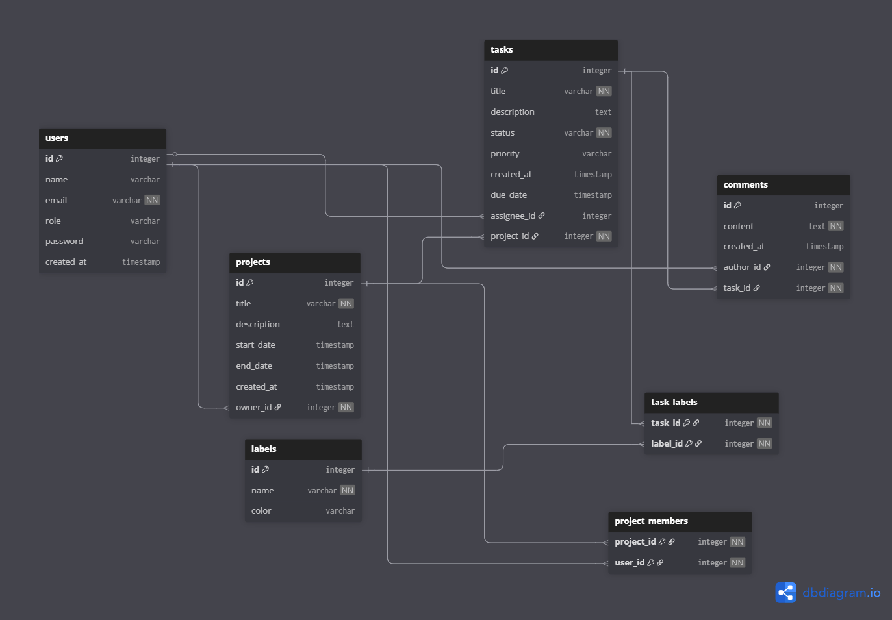

# Task Management Platform

A RESTful API for managing projects, tasks, and team collaboration built with Spring Boot.


[//]: # (![License]&#40;https://img.shields.io/badge/License-MIT-yellow&#41;)

## 🚀 Features

- **User Management** — Create and manage users with role-based access (Admin, Member, Viewer)
- **Project Management** — Organize work into projects with owners and team members
- **Task Tracking** — Create tasks with status (TODO, IN_PROGRESS, DONE)
- **Collaboration** — Comment on tasks and use labels for organization
- **RESTful API** — Clean, documented REST endpoints

## 🛠️ Tech Stack

- **Backend:** Spring Boot 3.2, Spring Data JPA, Hibernate
- **Database:** PostgreSQL 16 (dev: MySQL also supported)
- **Build Tool:** Maven
- **API Documentation:** OpenAPI 3.0 (Swagger UI)
- **Deployment:** Render.com (backend) | Neon.tech (database)

## 📚 API Documentation

This project uses OpenAPI 3.0 for API documentation.

### Interactive Documentation

Access the Swagger UI for interactive API testing:
- **Local:** http://localhost:8080/swagger-ui.html
- **Production:** [https://task-management-platform-backend-9hc5.onrender.com/swagger-ui.html](https://task-management-platform-backend-9hc5.onrender.com/swagger-ui.html)

### OpenAPI Specification

The OpenAPI spec is available at:
- **JSON:** http://localhost:8080/v3/api-docs
- **YAML:** http://localhost:8080/v3/api-docs.yaml

### Quick API Overview

| Endpoint        | Description        |
|-----------------|--------------------|
| `/api/users`    | User management    |
| `/api/projects` | Project management |
| `/api/tasks`    | Task management    |
| `/api/comments` | Comments on tasks  |
| `/api/labels`   | Label management   |
| `/api/stats`    | Platform stats     |

See Swagger UI for complete documentation including request/response schemas and the ability to test endpoints directly.


## 📂 Project Structure
```
src/main/java/com/akshansh/taskmanagementplatform/
├── controller/       # REST API endpoints
├── service/          # Business logic
├── repository/       # Data access layer
├── entity/           # JPA entities
├── dto/              # Request/Response DTOs
├── exception/        # Custom exceptions & handlers
└── config/           # Configuration classes
```

## 1️⃣ Getting Started

### Prerequisites

- Java 17 or higher
- Maven 3.8+
- PostgreSQL 16 (or MySQL 8+)

### Installation

1. **Clone the repository**
```bash
   git clone https://github.com/Akshansh029/Task-Management-Platform-Backend.git
   cd Task-Management-Platform-Backend
```

2. **Configure database**

   Create a PostgreSQL database:
```sql
   CREATE DATABASE taskmanager;
```

3. **Configure application.properties**
```bash
  spring.application.name=TaskManagementPlatform

  # Database (PostgreSQL on Render)
   spring.datasource.url="jdbc:postgresql://localhost:5432/taskmanager"
   spring.datasource.username="postgres"
   spring.datasource.password="your_password"
   spring.datasource.driver-class-name=org.postgresql.Driver
   
   # JPA/Hibernate
   spring.jpa.hibernate.ddl-auto=update
   spring.jpa.show-sql=false
   spring.jpa.properties.hibernate.dialect=org.hibernate.dialect.PostgreSQLDialect
   spring.jpa.properties.hibernate.format_sql=false
```

4. **Run the application**
```bash
   mvn spring-boot:run
```

The API will be available at `http://localhost:8080`

5. **Access Swagger UI**

   Open your browser: `http://localhost:8080/swagger-ui.html`

## 🐳 Docker Deployment

This project includes a Dockerfile for containerized deployment.

### Build Docker Image
```bash
docker build -t taskmanager-backend .
```

### Run Docker Container
```bash
docker run -p 8080:8080 \
  -e DATABASE_URL="jdbc:postgresql://host/db" \
  -e DB_USERNAME="user" \
  -e DB_PASSWORD="password" \
  taskmanager-backend
```

### Deploy to Render

Render automatically detects and builds from the Dockerfile. No additional configuration needed.

## 📦 Building for Production
```bash
# Create JAR file
mvn clean package -DskipTests

# Run the JAR
java -jar target/TaskManagementPlatform-0.0.1-SNAPSHOT.jar

# 
```

## 🌐 Deployment

The application is deployed on:
- **Backend:** [Render.com](https://render.com)
- **Database:** [Neon.tech](https://neon.tech)

### Environment Variables (Production)
```
DATABASE_URL=jdbc:postgresql://[HOST]/[DB_NAME]?sslmode=require
DB_USERNAME=your_db_user
DB_PASSWORD=your_db_password
```

## 🗄️ Database Schema

**Main Entities:**
- `users` — User accounts with roles
- `projects` — Projects with owners and members
- `tasks` — Tasks with status, priority, and assignments
- `comments` — Task comments
- `labels` — Reusable task labels



## 🔒 Security

⚠️ **Note:** Authentication is not yet implemented. This is planned for v2.0 with Spring Security and JWT.

Current version uses a simulated "active user" approach for development.

## 📌 Todo

- [ ] Spring Security with JWT authentication
- [ ] Role-based access control (RBAC)
- [ ] Unit and integration tests
- [ ] Activity logs / audit trail
- [ ] Task search and filtering
- [ ] Email notifications

## 🤝 Contributing

Contributions are welcome! Please feel free to submit a Pull Request.
